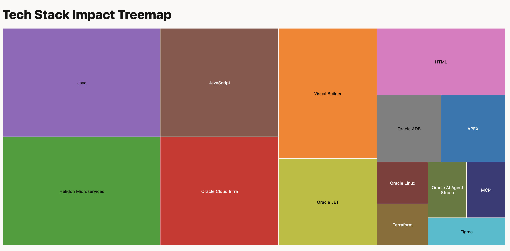

# Tech Stack Treemap (Oracle JET 19)



An Oracle JET 19 web app that renders a treemap of technologies and their impact using data from a CSV file. The app follows the JET Cookbook’s Treemap Node Content approach.

Demo target (local dev server):
- http://localhost:8000

## Tech Stack

- Oracle JET: 19.x (`@oracle/oraclejet`, `@oracle/oraclejet-core-pack`)
- JET CLI: `@oracle/ojet-cli` (scaffolding/serve/build)
- RequireJS (JET 19 AMD setup)
- Knockout (binding provider)
- Preact (via oraclejet-preact, included by JET)
- Node: engines ≥ 16 (project currently tested with Node 25.x)

## Project Structure

```
.
├─ src/
│  ├─ index.html                 # Contains <oj-treemap> with nodeContentTemplate
│  ├─ js/
│  │  ├─ main.js                 # RequireJS config injects JET paths
│  │  ├─ root.js                 # KO ViewModel: loads & parses CSV, provides DataProvider
│  │  └─ path_mapping.json       # Library/CDN mappings used by JET tooling
│  ├─ data/
│  │  └─ tech_2025.csv           # CSV data used by the treemap (served)
│  └─ css/                       # Theme and assets
├─ oraclejetconfig.json          # JET 19 app configuration
├─ package.json
└─ README.md
```

## Data Source

CSV file: `src/data/tech_2025.csv`

Columns:
- `technology` (string) – used as node label and id
- `impact` (number) – used as node value (size)
- `icon` (optional) – currently not used in this implementation
- `badge` (optional) – currently not used in this implementation

Example:

```
technology,impact,icon,badge
APEX,10,,
Visual Builder,30,,
Helidon Microservices,40,,
Oracle Cloud Infra,30,,
Java,40,,
...
```

Notes:
- Only flat items (leaf nodes) are used; no nested/hierarchical CSV is expected here.
- `impact` must be numeric; non-numeric values are treated as 0.

## Implementation Details

- Markup (src/index.html):

  - Uses `<oj-treemap data="[[dataProvider]]">`.
  - Custom leaf content via the Cookbook-recommended slot:
    ```
    <template slot="nodeContentTemplate" data-oj-as="node">
      <div style="pointer-events: none;">
        <span>[[node.data.label]]</span>
        <span>[[node.data.value]]</span>
      </div>
    </template>
    ```
  - `pointer-events: none` preserves node interactivity since custom HTML overlays the node.

- ViewModel (src/js/root.js):

  - Loads CSV text via RequireJS: `text!../data/tech_2025.csv`
  - Parses the CSV header/rows into an array of node objects:
    ```
    { id, label, value, icon, badge, shortDesc }
    ```
  - Creates an `ArrayTreeDataProvider(nodes, { keyAttributes: 'id' })`
  - Applies KO bindings to `#app`

## Run Locally

Prerequisites:
- Node ≥ 16 (tested on Node 25+)
- npm

Install:

```
npm ci
```

Start dev server (with live reload):

```
npx ojet serve
```

The app will be available at:
- http://localhost:8000

Build (development):

```
npx ojet build
```

Build (release/optimized):

```
npx ojet build --release
```

## Update the Data

- Edit `src/data/tech_2025.csv`
- Keep the header row intact: `technology,impact,icon,badge`
- Ensure `impact` is numeric
- Save – the dev server should live-reload and update the treemap

Alternatively, you can edit the source CSV in the project root (`tech_2025.csv`) and copy changes into `src/data/tech_2025.csv` if you prefer to keep a single source of truth.

## Troubleshooting

- No data appears:
  - Verify that `<template slot="nodeContentTemplate">` (not `nodeTemplate`) is used in `index.html`
  - Check that `data="[[dataProvider]]"` is present on `<oj-treemap>`
  - Open developer tools for any 404s loading `text!../data/tech_2025.csv`
- CSV changes don’t reflect:
  - Ensure you are editing `src/data/tech_2025.csv`
  - Confirm dev server logs “Page reloaded” when saving
- Node version issues:
  - Project indicates Node ≥ 16 in `package.json`. If using older versions, upgrade Node.
- Dependency issues:
  - Re-run `npm ci`
  - If audit warnings appear, they are typically unrelated to basic run/serve for this demo.

## References

- JET Treemap Cookbook (Node Content):
  - https://www.oracle.com/webfolder/technetwork/jet/jetCookbook.html?component=treemap&demo=nodeContent
- Oracle JET 19 Docs: https://github.com/oracle/oraclejet
- License: UPL 1.0 (see license headers in source files)

## Recent Changes Summary

- Added `<oj-treemap>` with `nodeContentTemplate` in `src/index.html`
- Implemented CSV parsing and data provider in `src/js/root.js`
- Included `src/data/tech_2025.csv` and wired to RequireJS text loader
- Verified with `npx ojet serve` (live reloading on file changes)
