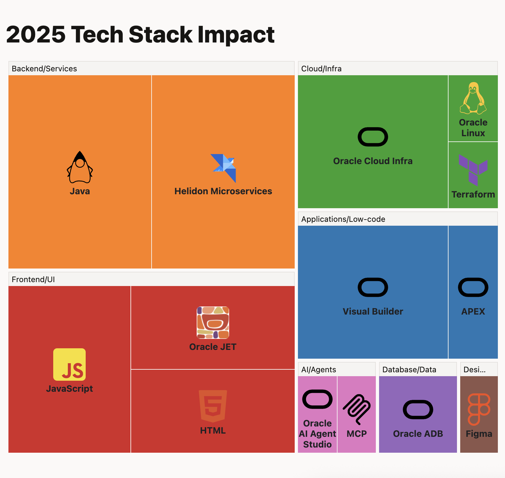

# Tech Stack Treemap (Oracle JET 19)



An Oracle JET 19 web app that renders a hierarchical treemap of technologies and their impact using data from a CSV file. The app uses the JET Cookbook’s Treemap Node Content approach to render icons on leaf nodes.

Demo target (local dev server):
- http://localhost:8000

## Tech Stack

- Oracle JET: 19.x (`@oracle/oraclejet`, `@oracle/oraclejet-core-pack`)
- JET CLI: `@oracle/ojet-cli` (scaffolding/serve/build)
- RequireJS (JET 19 AMD setup)
- Knockout (binding provider)
- Preact (via oraclejet-preact, included by JET)
- Node: engines ≥ 16 (project currently tested with Node 25.x)

## Project Structure

```
.
├─ src/
│  ├─ index.html                 # <oj-treemap> with nodeTemplate and nodeContentTemplate (icons)
│  ├─ js/
│  │  ├─ main.js                 # RequireJS config injects JET paths
│  │  ├─ root.js                 # KO ViewModel: loads & parses CSV to hierarchical nodes
│  │  └─ path_mapping.json       # Library/CDN mappings used by JET tooling
│  ├─ data/
│  │  └─ tech_2025.csv           # CSV data used by the treemap (served)
│  └─ css/
│     └─ images/
│        └─ tech/                # Icon assets used in leaf nodes
├─ docs/
│  └─ images/                    # Repo/documentation assets (source icon files also stored here)
├─ oraclejetconfig.json          # JET 19 app configuration
├─ package.json
└─ README.md
```

## Data Source

CSV file: `src/data/tech_2025.csv`

Columns (in order):
- `Area` (string) – parent group (e.g., Frontend/UI, Backend/Services)
- `technology` (string) – leaf node label and id suffix
- `impact` (number) – leaf node value (size)
- `id` (number/string) – not used as the DataProvider key; kept for reference

Example:

```
Area,technology,impact,id
Frontend/UI,Oracle JET,20,9
Backend/Services,Java,40,5
Cloud/Infra,Oracle Cloud Infra,30,4
...
```

Notes:
- The treemap is two-level hierarchical: Area (parent) → Technology (leaf).
- Parent node values are derived from the sum of children (no explicit value required).
- `impact` must be numeric; non-numeric values are treated as 0.

## Icons and Image Sources

- All technology icons used in the treemap are open-source brand icons sourced from Simple Icons (https://simpleicons.org/).
  - License: CC0 1.0 (Public Domain) — https://github.com/simple-icons/simple-icons/blob/develop/LICENSE.md
- Local copies of the SVGs are committed under `src/css/images/tech/` and are referenced by the app:
  - oracle.svg, java.svg, javascript.svg, html5.svg, figma.svg, terraform.svg, linux.svg, openjdk.svg, openai.svg
- The mapping from technology name → icon filename is defined in `src/js/root.js` (`iconMap`). If a technology is not in the map, a default `oracle.svg` icon is used.
- Additional SVG copies under `docs/images/` are the same open-source icons, used for documentation.
- Trademark notice: Brand names and logos are trademarks of their respective owners. Usage here follows each brand’s guidelines.
- Compliance note: We use only open-source icon assets (Simple Icons) and do not include copyrighted/non-open-source image assets.
- Screenshot note: `docs/images/tech-stack-tree-map.png` is a screenshot produced by this app for documentation and contains no third‑party copyrighted content.

## Implementation Details

- Markup (src/index.html):
  - Uses `<oj-treemap data="[[dataProvider]]">`.
  - nodeTemplate provides the base `<oj-treemap-node>` for all nodes:
    - `label`, `value` (for leaves), `color`, `short-desc`.
  - nodeContentTemplate overlays custom content for leaf nodes (icons and labels).
    - The overlay is absolutely positioned and uses `pointer-events: none` to preserve interactions.

- ViewModel (src/js/root.js):
  - Loads CSV text via RequireJS: `text!../data/tech_2025.csv`.
  - Parses the CSV into a two-level hierarchy grouped by `Area`:
    ```
    [
      {
        id: 'area:<Area>',
        label: <Area>,
        color: <stable color per Area>,
        shortDesc: 'Area: <Area>',
        nodes: [
          {
            id: 'tech:<technology>',
            label: <technology>,
            value: <impact>,
            area: <Area>,
            icon: <icon filename>,
            color: <Area color>,
            shortDesc: '<technology> (<Area>) - Impact: <impact>'
          },
          ...
        ]
      },
      ...
    ]
    ```
  - Creates `ArrayTreeDataProvider(groups, { keyAttributes: 'id', childrenAttribute: 'nodes' })`.
  - Applies KO bindings to `#app`.

## Run Locally

Prerequisites:
- Node ≥ 16 (tested on Node 25+)
- npm

Install:

```
npm ci
```

Start dev server (with live reload):

```
npx ojet serve
```

The app will be available at:
- http://localhost:8000

Build (development):

```
npx ojet build
```

Build (release/optimized):

```
npx ojet build --release
```

## Update the Data

- Edit `src/data/tech_2025.csv`
- Keep the header row intact: `Area,technology,impact,id`
- Ensure `impact` is numeric
- Save – the dev server should live-reload and update the treemap
- Optional: If you add new technologies, either:
  - Add a matching icon filename to `src/css/images/tech/` and update the `iconMap` in `root.js`, or
  - Rely on the default `oracle.svg` icon

## Troubleshooting

- No data appears:
  - Verify that both `nodeTemplate` and `nodeContentTemplate` exist in `index.html`
  - Check that `data="[[dataProvider]]"` is present on `<oj-treemap>`
  - Open developer tools for any 404s when loading `text!../data/tech_2025.csv`
- CSV changes don’t reflect:
  - Ensure you are editing `src/data/tech_2025.csv`
  - Confirm dev server logs “Page reloaded” when saving
- Icons not visible:
  - Confirm icon filenames in `src/css/images/tech/`
  - Ensure the icon mapping in `root.js` includes the technology name
  - Verify the CSS background image path: `css/images/tech/<icon>`
- Node version issues:
  - Project indicates Node ≥ 16 in `package.json`. If using older versions, upgrade Node.
- Dependency issues:
  - Re-run `npm ci`
  - If audit warnings appear, they are typically unrelated to basic run/serve for this demo.

## References

- JET Treemap Cookbook (Node Content):
  - https://www.oracle.com/webfolder/technetwork/jet/jetCookbook.html?component=treemap&demo=nodeContent
- Treemap Component:
  - https://www.oracle.com/webfolder/technetwork/jet/jetCookbook.html?component=treemap&demo=default
  - https://www.oracle.com/webfolder/technetwork/jet/jsdocs/oj.ojTreemap.html
  - https://www.oracle.com/webfolder/technetwork/jet/jsdocs/oj.ojTreemapNode.html
- Oracle JET 19 Docs: https://github.com/oracle/oraclejet
- License: UPL 1.0 (see license headers in source files)

## Recent Changes Summary

- Added `Area` column to CSV and populated group values
- Updated `parseCsv` to output two-level hierarchical structure grouped by Area
- Switched to `ArrayTreeDataProvider(..., { keyAttributes: 'id', childrenAttribute: 'nodes' })`
- Implemented `nodeContentTemplate` to overlay icons on leaf nodes
- Added and wired icon assets under `src/css/images/tech/`
- Updated documentation to reflect hierarchy and icon usage

## Cline Memory Bank

This repo includes a Cline Memory Bank to preserve context across sessions.

Location:
- memory-bank/
  - projectbrief.md
  - productContext.md
  - activeContext.md
  - systemPatterns.md
  - techContext.md
  - progress.md
- .clinerules (project-scoped Memory Bank custom instructions)

How to use with Cline:
- At the start of a session/task, type: “follow your custom instructions”
- To re-sync documentation as work progresses, type: “update memory bank”
- Cline will read/write the files above to keep context accurate
